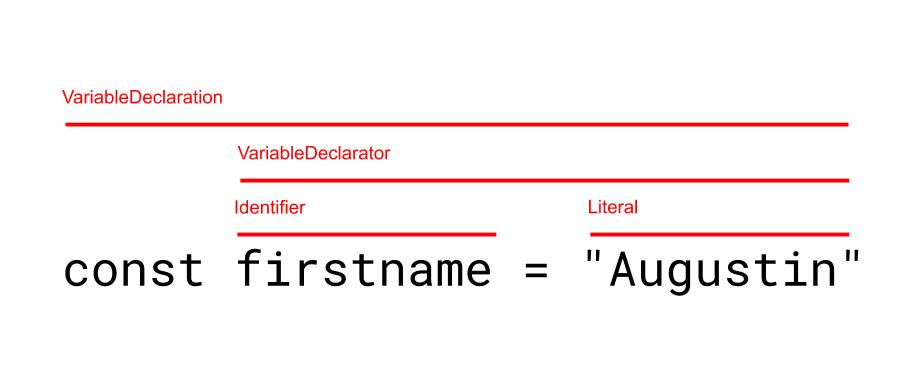

import { Notes, Appear } from "mdx-deck";
import { syntaxHighlighterPrism, code } from "mdx-deck/themes";
import { Me, Links } from "./me";

export const themes = [
  code,
  syntaxHighlighterPrism,
  { li: { fontSize: 28 }, pre: { fontSize: 24 } }
];

# Writing code to transform your codebase

---

<Me />

---

<Links />

---

## You execute a script, it updates your code.

<Notes>Demo time</Notes>

---

## Codemods my teams ran

- Tape -> jest
- Mocha + chai -> jest
- Decorators -> HOC
- Props renaming on react components
- ~150 components from components/index to components/myComponent

---

## Regex, search & replace are not always sufficient

---

```js
import createUser from "createUser";

// before
createUser({ name: "Augustin" });

// after
createUser({ name: "Augustin", id: null });
```

---

```javascript
import makeUser from "createUser";

// before
makeUser({ name: "Augustin" });

// after
makeUser({ name: "Augustin", id: null });

// How are you suppose to know that makeUser
// corresponds to createUser?
```

---

## How does a codemod work?

---

<div>Source code (string)</div>
<Appear>
  <div>
    <div>↓</div>
    <div>AST</div>
  </div>
  <div>
    <div>↓</div>
    <div>AST manipulation</div>
  </div>
  <div>
    <div>↓</div>
    <div>Code</div>
  </div>
</Appear>

---

## Abstract Syntax Tree

---



<Notes>
  This is not specific to jscodeshift, not to JavaScript. This follows a spec
  made by Mozilla. You'll find AST when working on plugins for babel or eslint,
  or whenever you'll work with a compiler.
</Notes>

---

## https://astexplorer.net/

---

- CLI to run the codemods, jscodeshift
- Parse the code with recast (uses babel or else behind the scenes)
- Query the AST with jscodeshift (jquery-like API)
- Create new nodes with ast-types
- Print back the code, using recast

---

Resources

<div style={{paddingRight: '5%', paddingLeft: '5%'}}>

- https://github.com/facebook/jscodeshift
- https://github.com/benjamn/recast
- https://github.com/benjamn/ast-types
- Mozilla Parser API: https://developer.mozilla.org/en-US/docs/Mozilla/Projects/SpiderMonkey/Parser_API
- Babel Plugin handbook https://github.com/jamiebuilds/babel-handbook
- Christoph Nakazawa: Evolving Complex Systems Incrementally | JSConf EU 2015 https://www.youtube.com/watch?v=d0pOgY8__JM

</div>
